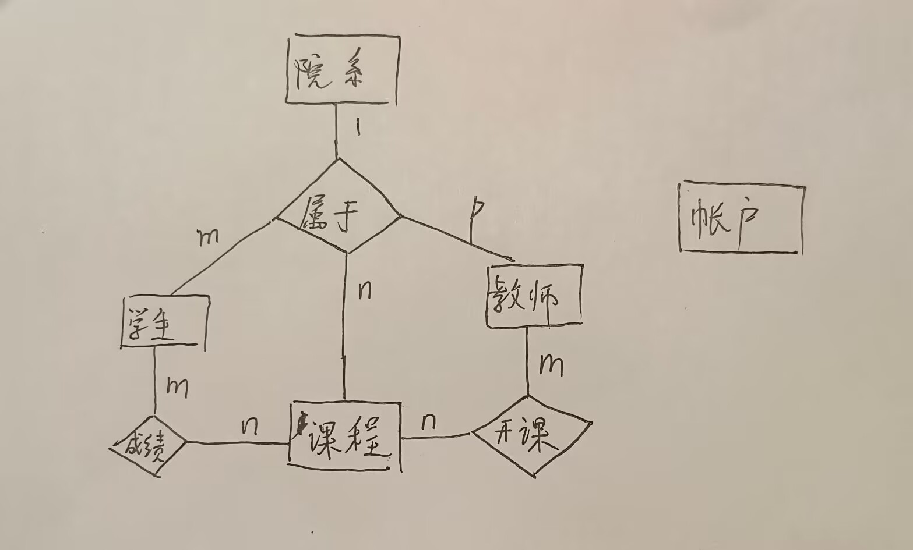

## 学生课程成绩管理系统


### 项目简介
<!-- 参考自[StudentSystem](https://github.com/2019ZSS/StudentSystem?utm_source=chatgpt.com) -->
```
    这是一个基于Python Pyqt5实现的学生课程成绩管理系统。
    C/S 模式
    用户面向：学生和老师

    主要功能模块有课程管理和成绩管理
    课程管理模块：
        学生可以进行本学期的课程查询，选课，退课，课程表查询，查询所修过的所有课程。
        教师可以开设本学期课程或者撤销开设的课程
    成绩管理模块：
        学生查看学期成绩单
        教师评定每门课程学生成绩

    项目意义：学习数据库相关知识并进行实际项目生产。(为了完成俺们的数据库期末大作业的动手实践(逃))
```

### 项目环境
```
    项目实现: python3.7 + mysql
    python相关包: Pyqt5, pymysql, numpy
     
    项目有关的数据库：
    基于(数据库原理)上课所学
    1. 使用的六个基本数据表: 学生表，教师表，院系表，课程表，开课表，选课表.
    2. 新创建的一个用户表。
    数据表具体创建可参见 create.sql
```

### 项目分工
| 组员 | 分工 |
| --- | --- |
| 张铭昊 | 后端接口实现 |
| 束建杰 | 数据库设计 |
| 郑昕晨 | 前后端结合式开发 |
| 叶晨新 | 前端界面-Course模块与运行测试 |
| 彭千容 | 前端界面-Score模块与运行测试 |

### 功能
共分为两种身份，两种模块，身份有学生和教师，模块有课程管理和成绩管理

学生课程管理：
- 课程查询
- 选课
- 退课
- 课程表查询
- 所修课程查询

学生成绩管理：
- 学期成绩单查询

教师课程管理：
- 课程查询
- 已开课程查询
- 开设课程
- 撤销课程

教师成绩管理：
- 成绩查询
- 成绩录入

### 数据需求
1. 院系表 ：保存学院信息（院系编号，院系名称）
2. 学生表 ：保存学生信息（学号，姓名，性别，年龄，院系编号）
3. 教师表 ：保存教师信息（工号，姓名，性别，年龄，院系编号）
4. 课程表 ：保存课程信息（课号，课程名称，学分）
5. 开课表 ：保存开课信息（学期，课号，工号，上课时间）
6. 成绩表 ：保存成绩信息（学号，学期，课号，工号，平时成绩，考试成绩，总评成绩）
7. 用户表 ：保存用户信息（用户名，密码）

### 数据库设计
#### 实体定义
1. 院系

2. 学生

3. 教师

4. 课程


#### E-R图


#### 关系模式转换


#### 依赖分析

以下是各关系模式的范式等级分析：

---

### **1. 院系表 $d(yxh, mc, dz, lxdh)$**  
主键：$\{\text{yxh}\}$  

#### 范式分析：  
1. **1NF**：  
   - 所有列均为原子值，满足 1NF。  

2. **2NF**：  
   - 主键 $\{\text{yxh}\}$，其他属性 $\text{mc}, \text{dz}, \text{lxdh}$ 完全依赖于主键，没有部分依赖，满足 2NF。  

3. **3NF**：  
   - 所有非主属性直接依赖主键，没有传递依赖，满足 3NF。  

4. **BCNF**：  
   - 主键 $\{\text{yxh}\}$ 是超键，满足 BCNF。  

#### **结论**：$d$ 满足 **BCNF**。

---

### **2. 学生表 $s(xh, xm, xb, csrq, jg, sjhm, yxh)$**  
主键：$\{\text{xh}\}$  

#### 范式分析：  
1. **1NF**：  
   - 列值为原子值，满足 1NF。  

2. **2NF**：  
   - 主键 $\{\text{xh}\}$，所有非主属性直接依赖主键，无部分依赖，满足 2NF。  

3. **3NF**：  
   - 非主属性 $\text{yxh}$ 直接依赖主键 $\{\text{xh}\}$，无传递依赖，满足 3NF。  

4. **BCNF**：  
   - 唯一的函数依赖是 $\{\text{xh}\} \to \{\text{其他属性}\}$，主键是超键，满足 BCNF。  

#### **结论**：$s$ 满足 **BCNF**。

---

### **3. 教师表 $t(gh, xm, xb, csrq, xl, jbgz, yxh)$**  
主键：$\{\text{gh}\}$  

#### 范式分析：  
1. **1NF**：  
   - 列值为原子值，满足 1NF。  

2. **2NF**：  
   - 主键 $\{\text{gh}\}$，所有非主属性直接依赖主键，无部分依赖，满足 2NF。  

3. **3NF**：  
   - 非主属性 $\text{yxh}$ 直接依赖主键 $\{\text{gh}\}$，无传递依赖，满足 3NF。  

4. **BCNF**：  
   - 唯一的函数依赖是 $\{\text{gh}\} \to \{\text{其他属性}\}$，主键是超键，满足 BCNF。  

#### **结论**：$t$ 满足 **BCNF**。

---

### **4. 课程表 $c(kh, km, xf, xs, yxh)$**  
主键：$\{\text{kh}\}$  

#### 范式分析：  
1. **1NF**：  
   - 列值为原子值，满足 1NF。  

2. **2NF**：  
   - 主键 $\{\text{kh}\}$，所有非主属性直接依赖主键，无部分依赖，满足 2NF。  

3. **3NF**：  
   - 非主属性 $\text{yxh}$ 直接依赖主键 $\{\text{kh}\}$，无传递依赖，满足 3NF。  

4. **BCNF**：  
   - 唯一的函数依赖是 $\{\text{kh}\} \to \{\text{其他属性}\}$，主键是超键，满足 BCNF。  

#### **结论**：$c$ 满足 **BCNF**。

---

### **5. 开课表 $o(xq, kh, gh, sksj)$**  
主键：$\{\text{xq}, \text{kh}, \text{gh}\}$  

#### 范式分析：  
1. **1NF**：  
   - 列值为原子值，满足 1NF。  

2. **2NF**：  
   - 主键 $\{\text{xq}, \text{kh}, \text{gh}\}$，非主属性 $\text{sksj}$ 完全依赖主键，无部分依赖，满足 2NF。  

3. **3NF**：  
   - 非主属性 $\text{sksj}$ 直接依赖主键，无传递依赖，满足 3NF。  

4. **BCNF**：  
   - 唯一的函数依赖是 $\{\text{xq}, \text{kh}, \text{gh}\} \to \text{sksj}$，主键是超键，满足 BCNF。  

#### **结论**：$o$ 满足 **BCNF**。

---

### **6. 成绩表 $e(xh, xq, kh, gh, pscj, kscj, zpcj)$**  
主键：$\{\text{xh}, \text{xq}, \text{kh}, \text{gh}\}$  

#### 范式分析：  
1. **1NF**：  
   - 列值为原子值，满足 1NF。  

2. **2NF**：  
   - 主键 $\{\text{xh}, \text{xq}, \text{kh}, \text{gh}\}$，非主属性 $\text{pscj}, \text{kscj}, \text{zpcj}$ 完全依赖主键，无部分依赖，满足 2NF。  

3. **3NF**：  
   - 非主属性直接依赖主键，无传递依赖，满足 3NF。  

4. **BCNF**：  
   - 唯一的函数依赖是 $\{\text{xh}, \text{xq}, \text{kh}, \text{gh}\} \to \{\text{pscj}, \text{kscj}, \text{zpcj}\}$，主键是超键，满足 BCNF。  

#### **结论**：$e$ 满足 **BCNF**。

---

### **7. 账户表 $Account(usr, pwd)$**  
主键：$\{\text{usr}\}$  

#### 范式分析：  
1. **1NF**：  
   - 列值为原子值，满足 1NF。  

2. **2NF**：  
   - 主键 $\{\text{usr}\}$，非主属性 $\text{pwd}$ 完全依赖主键，无部分依赖，满足 2NF。  

3. **3NF**：  
   - 非主属性 $\text{pwd}$ 直接依赖主键，无传递依赖，满足 3NF。  

4. **BCNF**：  
   - 唯一的函数依赖是 $\{\text{usr}\} \to \{\text{pwd}\}$，主键是超键，满足 BCNF。  

#### **结论**：$Account$ 满足 **BCNF**。

---

### 总结  
| 关系模式         | 主键                                             | 范式等级 |
| ---------------- | ------------------------------------------------ | -------- |
| 院系表 $d$       | $\{\text{yxh}\}$                                 | **BCNF** |
| 学生表 $s$       | $\{\text{xh}\}$                                  | **BCNF** |
| 教师表 $t$       | $\{\text{gh}\}$                                  | **BCNF** |
| 课程表 $c$       | $\{\text{kh}\}$                                  | **BCNF** |
| 开课表 $o$       | $\{\text{xq}, \text{kh}, \text{gh}\}$            | **BCNF** |
| 成绩表 $e$       | $\{\text{xh}, \text{xq}, \text{kh}, \text{gh}\}$ | **BCNF** |
| 账户表 $Account$ | $\{\text{usr}\}$                                 | **BCNF** |


---


#### 物理结构


### 项目目录
```

    --APP(程序运行主目录)
        main.py(从此文件运行整个项目运行)
        login.py
        register.py
    --BACK(后台数据库接口实现)
        util.py
        course.py
        score.py
    --Course(课程管理模块)
        Student
        Teacher
    --Score(成绩管理模块)
        Student
        Teacher
    --image(程序图标存放)
```

### 遇到的问题
1. 当老师本学期未开任何课时，成绩查询按钮单击会导致程序崩溃（已修复）
2. 当老师开不存在的课程时，成绩查询按钮单击会导致程序崩溃（已修复）

### 如何运行
1. 确保你安装了上“项目环境”中的python包
2. 确保你安装了mysql 8.x 以上版本（可参考此链接教程安装：<a href="https://www.cnblogs.com/canfengfeixue/p/18002244">mysql安装教程</a>）
3. 在mysql中运行文件[create.sql](./create.sql)创建对应数据库和数据表
4. 修改[util.py](./BACK/util.py)中的数据库连接信息为你自己的mysql信息
```python
mysql_info = {
            'host': 'localhost', # 数据库地址
            'user': 'root', # 数据库用户身份
            'password': '123456', # 数据库用户对应的密码密码
            'db': 'school', # 数据库的名字
            'charset': 'utf8', # 数据库编码方式
            'autocommit': True}
db = Database(mysql_info)
```
5. 运行[main.py](./APP/main.py)即可


