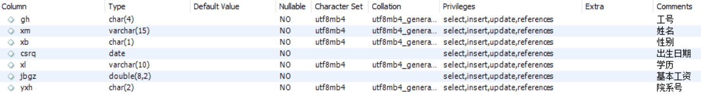
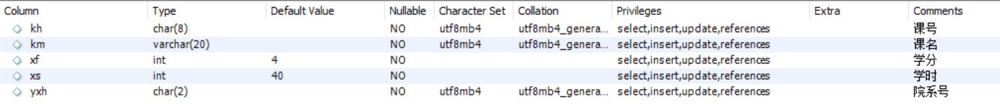
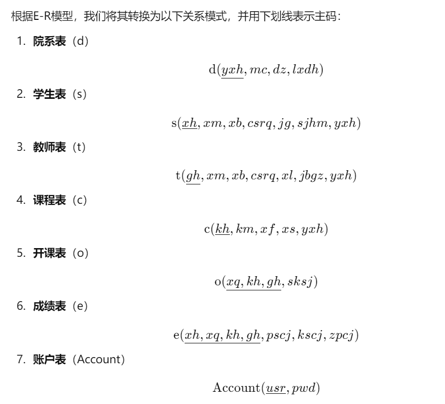
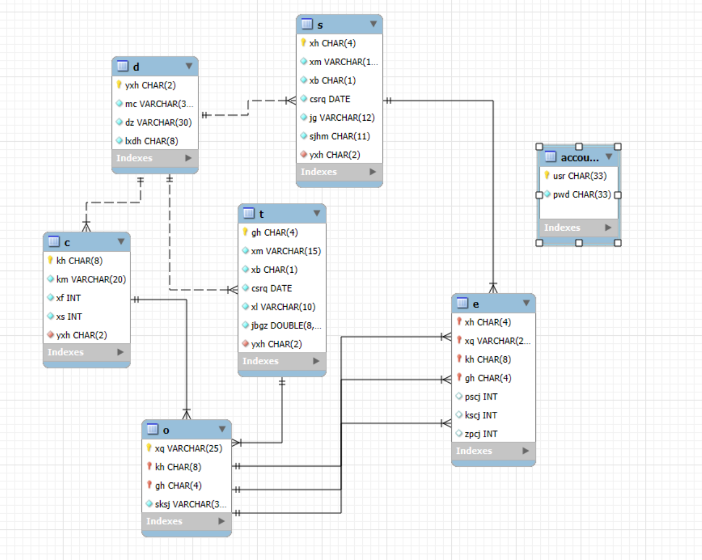
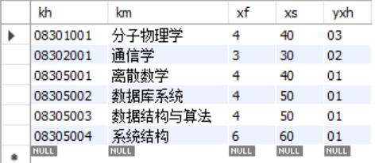

## 学生课程成绩管理系统 设计报告

## 成员 
张铭昊 郑昕晨 束建杰 叶晨新 彭千容

## 目录

[TOC]

### 一、需求分析部分

#### 1. 背景概述

```
    这是一个基于Python Pyqt5实现的学生课程成绩管理系统

    用户面向：学生和老师

    主要功能模块有课程管理和成绩管理
    课程管理模块：
        学生可以进行本学期的课程查询，选课，退课，课程表查询，查询所修过的所有课程。
        教师可以开设本学期课程或者撤销开设的课程
    成绩管理模块：
        学生查看学期成绩单
        教师评定每门课程学生成绩

    项目意义：学习数据库相关知识并进行实际项目生产
```

#### 2. 功能需求

共分为两种身份，两种模块，身份有学生和教师，模块有课程管理和成绩管理

**学生课程管理**
  - 课程查询
  - 选课
  - 退课
  - 课程表查询
  - 所修课程查询

**学生成绩管理**
  - 学期成绩单查询

**教师课程管理**
  - 课程查询
  - 已开课程查询
  - 开设课程
  - 撤销课程

**教师成绩管理**
  - 成绩查询
  - 成绩录入
	

#### 3. 数据需求

1. **院系表** 

*	保存学院信息（院系编号，院系名称）

2. **学生表** 

*	保存学生信息（学号，姓名，性别，年龄，院系编号）

3. **教师表** 

*	保存教师信息（工号，姓名，性别，年龄，院系编号）

4. **课程表** 

*	保存课程信息（课号，课程名称，学分）

5. **开课表** 

*	保存开课信息（学期，课号，工号，上课时间）

6. **成绩表** 

*	保存成绩信息（学号，学期，课号，工号，平时成绩，考试成绩，总评成绩）

7. **用户表** 

*	保存用户信息（用户名，密码）

### 二、数据库设计部分

#### 1. 概念结构设计

包含院系、学生、教师、课程  4 个实体。每个实体的属性、码如下：

##### 1.1 实体

1. 院系

2. 学生

3. 教师

4. 课程


##### 1.2 ER 图


#### 2. 逻辑结构设计

##### 2.1 关系模式转换

关系模式中，一共有5个主体，2个多对多的关系，故设计七个关系模式



##### 2.2 依赖分析

以下是各关系模式的范式等级分析：


###### **1. 院系表 $d(yxh, mc, dz, lxdh)$**  
主键：$\{\text{yxh}\}$  

**范式分析：**  
1. **1NF**：  
   - 所有列均为原子值，满足 1NF。  

2. **2NF**：  
   - 主键 $\{\text{yxh}\}$，其他属性 $\text{mc}, \text{dz}, \text{lxdh}$ 完全依赖于主键，没有部分依赖，满足 2NF。  

3. **3NF**：  
   - 所有非主属性直接依赖主键，没有传递依赖，满足 3NF。  

4. **BCNF**：  
   - 主键 $\{\text{yxh}\}$ 是超键，满足 BCNF。  

**结论**：$d$ 满足 **BCNF**。


###### **2. 学生表 $s(xh, xm, xb, csrq, jg, sjhm, yxh)$**  
主键：$\{\text{xh}\}$  

**范式分析：**  
1. **1NF**：  
   - 列值为原子值，满足 1NF。  

2. **2NF**：  
   - 主键 $\{\text{xh}\}$，所有非主属性直接依赖主键，无部分依赖，满足 2NF。  

3. **3NF**：  
   - 非主属性 $\text{yxh}$ 直接依赖主键 $\{\text{xh}\}$，无传递依赖，满足 3NF。  

4. **BCNF**：  
   - 唯一的函数依赖是 $\{\text{xh}\} \to \{\text{其他属性}\}$，主键是超键，满足 BCNF。  

**结论**：$s$ 满足 **BCNF**。


###### **3. 教师表 $t(gh, xm, xb, csrq, xl, jbgz, yxh)$**  
主键：$\{\text{gh}\}$  

**范式分析：**  
1. **1NF**：  
   - 列值为原子值，满足 1NF。  

2. **2NF**：  
   - 主键 $\{\text{gh}\}$，所有非主属性直接依赖主键，无部分依赖，满足 2NF。  

3. **3NF**：  
   - 非主属性 $\text{yxh}$ 直接依赖主键 $\{\text{gh}\}$，无传递依赖，满足 3NF。  

4. **BCNF**：  
   - 唯一的函数依赖是 $\{\text{gh}\} \to \{\text{其他属性}\}$，主键是超键，满足 BCNF。  

**结论**：$t$ 满足 **BCNF**。


###### **4. 课程表 $c(kh, km, xf, xs, yxh)$**  
主键：$\{\text{kh}\}$  

**范式分析：**  
1. **1NF**：  
   - 列值为原子值，满足 1NF。  

2. **2NF**：  
   - 主键 $\{\text{kh}\}$，所有非主属性直接依赖主键，无部分依赖，满足 2NF。  

3. **3NF**：  
   - 非主属性 $\text{yxh}$ 直接依赖主键 $\{\text{kh}\}$，无传递依赖，满足 3NF。  

4. **BCNF**：  
   - 唯一的函数依赖是 $\{\text{kh}\} \to \{\text{其他属性}\}$，主键是超键，满足 BCNF。  

**结论**：$c$ 满足 **BCNF**。


###### **5. 开课表 $o(xq, kh, gh, sksj)$**  
主键：$\{\text{xq}, \text{kh}, \text{gh}\}$  

**范式分析：**  
1. **1NF**：  
   - 列值为原子值，满足 1NF。  

2. **2NF**：  
   - 主键 $\{\text{xq}, \text{kh}, \text{gh}\}$，非主属性 $\text{sksj}$ 完全依赖主键，无部分依赖，满足 2NF。  

3. **3NF**：  
   - 非主属性 $\text{sksj}$ 直接依赖主键，无传递依赖，满足 3NF。  

4. **BCNF**：  
   - 唯一的函数依赖是 $\{\text{xq}, \text{kh}, \text{gh}\} \to \text{sksj}$，主键是超键，满足 BCNF。  

**结论**：$o$ 满足 **BCNF**。


###### **6. 成绩表 $e(xh, xq, kh, gh, pscj, kscj, zpcj)$**  
主键：$\{\text{xh}, \text{xq}, \text{kh}, \text{gh}\}$  

**范式分析：**  
1. **1NF**：  
   - 列值为原子值，满足 1NF。  

2. **2NF**：  
   - 主键 $\{\text{xh}, \text{xq}, \text{kh}, \text{gh}\}$，非主属性 $\text{pscj}, \text{kscj}, \text{zpcj}$ 完全依赖主键，无部分依赖，满足 2NF。  

3. **3NF**：  
   - 非主属性直接依赖主键，无传递依赖，满足 3NF。  

4. **BCNF**：  
   - 唯一的函数依赖是 $\{\text{xh}, \text{xq}, \text{kh}, \text{gh}\} \to \{\text{pscj}, \text{kscj}, \text{zpcj}\}$，主键是超键，满足 BCNF。  

**结论**：$e$ 满足 **BCNF**。


###### **7. 账户表 $Account(usr, pwd)$**  
主键：$\{\text{usr}\}$  

**范式分析：**  
1. **1NF**：  
   - 列值为原子值，满足 1NF。  

2. **2NF**：  
   - 主键 $\{\text{usr}\}$，非主属性 $\text{pwd}$ 完全依赖主键，无部分依赖，满足 2NF。  

3. **3NF**：  
   - 非主属性 $\text{pwd}$ 直接依赖主键，无传递依赖，满足 3NF。  

4. **BCNF**：  
   - 唯一的函数依赖是 $\{\text{usr}\} \to \{\text{pwd}\}$，主键是超键，满足 BCNF。  

**结论**：$Account$ 满足 **BCNF**。

#### 总结  
| 关系模式         | 主键                                             | 范式等级 |
| ---------------- | ------------------------------------------------ | -------- |
| 院系表 $d$       | $\{\text{yxh}\}$                                 | **BCNF** |
| 学生表 $s$       | $\{\text{xh}\}$                                  | **BCNF** |
| 教师表 $t$       | $\{\text{gh}\}$                                  | **BCNF** |
| 课程表 $c$       | $\{\text{kh}\}$                                  | **BCNF** |
| 开课表 $o$       | $\{\text{xq}, \text{kh}, \text{gh}\}$            | **BCNF** |
| 成绩表 $e$       | $\{\text{xh}, \text{xq}, \text{kh}, \text{gh}\}$ | **BCNF** |
| 账户表 $Account$ | $\{\text{usr}\}$                                 | **BCNF** |


##### 2.4 联系

实体间的联系如下：

**一对一**：

无
	

**一对多**：

*  院系 - 学生
*  院系 - 教师
*  院系 - 课程
	

**多对多**：

*  学生 - 课程（选课）
*  教师 - 课程（开课）

#### 3. 物理结构设计

##### 3.1 具体设计



其中，实线表示关系模式有强关系，虚线表示关系模式有弱关系。
##### 3.2 关系实体

本节列出了数据库中的关系实体，包括院系、学生、教师、课程、开课、成绩、账户等。

**1.院系表**
```sql
create table d(
	 yxh char(2) not null comment '院系号',
	 mc varchar(30) not null comment '院系名称',
	 dz varchar(30) not null comment '地址',
	 lxdh char(8) not null comment '联系电话',
	 primary key (yxh) using btree,
	 check (yxh >= '01' and yxh <= '99')
) engine = InnoDB default charset = utf8mb4 collate utf8mb4_general_ci comment = '院系表';
```

**2.学生表**
```sql
create table s(
	xh char(4) not null comment '学号',
	xm varchar(12) not null comment '姓名',
	xb char(1) not null comment '性别',
	csrq date not null comment '出生日期',
	jg varchar(12) not null comment '籍贯',
	sjhm char(11) not null comment '手机号码',
	yxh char(2) not null comment '院系号',
	primary key (xh) using btree,
 	constraint fk_yxh_s foreign key (yxh) references d(yxh) on delete cascade on update cascade
) engine = InnoDB default charset = utf8mb4 collate utf8mb4_general_ci comment = '学生表';
```

**3.教师表**
```sql
create table t(
	 gh char(4) not null comment '工号',
	 xm varchar(15) not null comment '姓名',
	 xb char(1) not null comment '性别',  
	 csrq date not null comment '出生日期',
	 xl varchar(10) not null comment '学历',
	 jbgz double(8, 2) not null comment '基本工资',
	 yxh char(2) not null comment '院系号',
	 primary key (gh) using btree,
	 constraint fk_yxh_t foreign key (yxh) references d(yxh) on delete cascade on update cascade
) engine = InnoDB default charset = utf8mb4 collate utf8mb4_general_ci comment = '教师表';
```

**4.课程表**
```sql
create table c(
	 kh char(8) not null comment '课号',
	 km varchar(20) not null comment '课名',
	 xf int not null default 4 comment '学分',
	 xs int not null default 40 comment '学时',
	 yxh char(2) not null comment '院系号',
	 primary key (kh) using btree,
	 constraint fk_yxh_c foreign key (yxh) references d(yxh) on delete cascade on update cascade
);
```

**5.开课表**
```sql
create table O (
	xq varchar(25) not null comment '学期',
	kh char(8) not null comment '课号',
	gh char(4) not null comment '工号',
	sksj varchar(30) not null comment '上课时间',
	primary key (xq, kh, gh) using btree,
	constraint fk_kh_o foreign key (kh) references c(kh) on delete cascade on update cascade,
	constraint fk_gh_o foreign key (gh) references t(gh) on delete cascade on update cascade
) engine = InnoDB default charset = utf8mb4 collate utf8mb4_general_ci comment = '开课表';
```

**6.成绩表**
```sql
create table e(
	xh char(4) not null comment '学号',
	xq varchar(25) not null comment '学期',
	kh char(8) not null comment '课号',
	gh char(4) not null comment '工号',
	pscj int comment '平时成绩',
	check(pscj >= 0 and pscj < 101),
	kscj int comment '考试成绩',
	check(kscj >= 0 and kscj < 101),
	zpcj int comment '总评成绩',
	check(zpcj >= 0 and zpcj < 101),
	primary key (xh, xq, kh, gh) using btree,
	constraint fk_xh_e foreign key (xh) references s(xh) on delete cascade on update cascade,
	constraint fk_xq_e foreign key (xq) references o(xq) on delete cascade on update cascade,
	constraint fk_kh_e foreign key (kh) references o(kh) on delete cascade on update cascade,
	constraint fk_gh_e foreign key (gh) references o(gh) on delete cascade on update cascade
) engine = InnoDB default charset = utf8mb4 collate utf8mb4_general_ci comment = '成绩表';
```

**7.账户表**
```sql
create table Account(
	usr char(33) not null comment '用户名',
	pwd char(33) not null comment '密码',
	primary key (usr) using btree
) engine = InnoDB default charset = utf8mb4 collate utf8mb4_general_ci comment = '账户表';
```


##### 3.3 存取方式

如上代码中，我们使用了btree索引，这是一种常用的索引方式，它可以加快数据的检索速度，提高数据库的性能。

##### 4.4 存储结构

我们使用了InnoDB存储引擎，这是MySQL的一种存储引擎，它支持事务处理，具有较高的性能和可靠性。

我们的数据库使用了utf8mb4字符集，这是一种支持中文的字符集，可以存储中文字符。

我们的collate设置为utf8mb4_general_ci，这是一种字符集校对规则，可以保证数据的正确性。

#### 4. 运行测试

我们使用了MySQL Workbench进行了数据库的建立和测试，部分测试结果如下：

**院系表**

插入了三条数据


**学生表**

插入了7条数据


**教师表**

插入了4条数据


**课程表**

插入了6条数据



**开课表**

插入了8条非本学期的数据


**成绩表**

插入了很多数据


**账户表**

没有插入数据

### 三、软件设计部分

#### 1. 系统架构
1. pyQt5 : 用于实现图形界面
2. pymysql : 用于连接数据库

#### 2. 系统模块设计

将系统分为四个模块：
1. APP : 主程序入口
2. Course : 课程管理模块
3. Score : 成绩管理模块
4. BACK : 后端接口

其中1-3模块相互连接，也称前后端不分离式开发，4模块为后端接口，负责与数据库交互。

#### 3. 详细设计

由于篇幅较长，这里只介绍关键函数设计，详细设计请查看源代码。

##### 3.1 BACK

BACK模块放在前面介绍是因为它是整个系统的核心，负责与数据库交互。

其中最为关键的是连接函数，如下：

```python
class Database:
    """
    Tables used in the database:
    department: did; name
    student: sid; name; gender; did; password
    teacher: tid; name; gender; did; password
    course: cid; name; credit; tid; did; time
    selection: cid; sid; score
    """
    def __init__(self, mysql_info):
        self._connection = pymysql.connect(**mysql_info)

    def __del__(self):
        self._connection.close()
    
    def _execute(self, query):
        '''
        返回执行结果
        '''
        try:
            # 创建游标对象
            cursor = self._connection.cursor()
            cursor.execute(query)
            s = query.split()[0]

            res = None
            if s == 'update' or s == 'insert' or s == 'delete':
                self._connection.commit()
                cursor.close()
            elif s == 'select':
                res = cursor.fetchall()
                cursor.close()
            return (True, res)
        except Exception as e:
            self._connection.rollback()
            return (False, e)

mysql_info = {
            'host': 'localhost', # 数据库地址
            'user': 'root', # 数据库用户身份
            'password': '123456', # 数据库用户对应的密码密码
            'db': 'school', # 数据库的名字
            'charset': 'utf8', # 数据库编码方式
            'autocommit': True}
db = Database(mysql_info)
```
此为数据库连接函数，负责连接数据库，执行sql语句，包含了事务处理。

##### 3.2 APP

APP模块是整个系统的入口，负责界面的显示。

登录模块中重要函数为：

```python
      def loginCheck(self):

        usr = self.userInput.text()
        pwd = self.pwdInput.text()

        if usr == '':
            QMessageBox.warning(self, "warning", "用户名不能为空", QMessageBox.Yes)
        elif pwd == '':
            QMessageBox.warning(self, "warning", "密码不能为空", QMessageBox.Yes)
        else:
            if self.stubtn.isChecked() == False and self.teabtn.isChecked() == False:
                QMessageBox.warning(self, "warning", "请选择您的身份", QMessageBox.Yes)
            else:
                flag = login(usr, pwd, self.stubtn.isChecked()) 
                if flag == 0:
                    if self.mainWindow is not None:
                        self.close()
                        self.mainWindow.usr = usr
                        self.mainWindow.isstu = self.stubtn.isChecked()
                        self.mainWindow.showbottom()
                        self.mainWindow.show()
                elif flag == 1:
                    QMessageBox.warning(self, 'Sorry', '抱歉, 您输入的密码有误', QMessageBox.Yes)
                elif flag == 2:
                    QMessageBox.warning(self, 'Sorry', '抱歉, 该用户名不存在', QMessageBox.Yes)
                elif flag == 3:
                    if self.stubtn.isChecked():
                        QMessageBox.warning(self, 'Sorry', '抱歉, 该学生用户不存在', QMessageBox.Yes)
                    else:
                        QMessageBox.warning(self, 'Sorry', '抱歉, 该教师用户不存在', QMessageBox.Yes)
                elif flag == -2:
                    QMessageBox.warning(self, 'Oh my god', '你程序bug了, 快维修吧', QMessageBox.Yes)

        self.userInput.clear()
        self.pwdInput.clear()
```

此函数负责登录检查，包括用户名密码是否为空，是否选择身份，是否存在该用户等。

注册函数如：

```python
    def onRegister(self):

        usr = self.userInput.text()
        pwd = self.pwdInput.text()
        cpwd = self.cpwdInput.text()

        if self.stubtn.isChecked() == False and self.teabtn.isChecked() == False:
             QMessageBox.warning(self, 'Warining', '没有选择您的身份', QMessageBox.Yes)
        else:
            flag = register(usr, pwd, cpwd, self.stubtn.isChecked())
            if flag == 1:
                QMessageBox.warning(self, 'Warining', '两次输入密码不一致', QMessageBox.Yes)
            elif flag == 2:
                QMessageBox.warning(self, 'Warining', '该用户已注册', QMessageBox.Yes)
            elif flag == 3:
                if self.stubtn.isChecked():
                    QMessageBox.warning(self, 'Sorry', '抱歉, 该学生用户不存在', QMessageBox.Yes)
                else:
                    QMessageBox.warning(self, 'Sorry', '抱歉, 该教师用户不存在', QMessageBox.Yes)
            elif flag == 0:
                QMessageBox.information(self, '恭喜', '注册成功', QMessageBox.Yes, QMessageBox.Yes)
                self.onLogin()
            elif flag == -1:
                QMessageBox.warning(self, 'Warining', '输入不能为空', QMessageBox.Yes)
            else:
                QMessageBox.warning(self, 'Warining', '你程序写烂了', QMessageBox.Yes)

        self.userInput.clear()
        self.pwdInput.clear()
        self.cpwdInput.clear()
```

此函数负责注册检查，包括用户名密码是否为空，是否选择身份，是否存在该用户等。

##### 3.3 Course

课程管理模块，包括课程查询，选课，退课，课程表查询，查询所修过的所有课程，会区分学生和教师。

该模块功能函数较多，这里举一个示例以介绍如何与BACK交互：
```python
        '''onSelect 方法处理选课操作，检查用户选择的课程，
        并调用 util.selectCourse 方法进行选课。如果选课成功，显示成功消息；否则，显示冲突消息。'''

    def onSelect(self):

        for i in range(self.rownum):
            if self.rbtns[i].isChecked() == True:
                reply = QMessageBox.question(self, '提示', '确认选课', QMessageBox.Yes | QMessageBox.No, QMessageBox.Yes)
                if reply == QMessageBox.No:
                    return None
                kh = self.showtable.item(i, 1).text()
                gh = self.showtable.item(i, 3).text()
                flag = util.selectCourse(self.usr, self.term, kh, gh)
                if flag == True:
                    QMessageBox.information(self, '恭喜', '选课成功', QMessageBox.Yes)
                else:
                    QMessageBox.information(self, '抱歉', '课时冲突', QMessageBox.Yes)
                return None
    
        QMessageBox.warning(self, 'warning', '对不起你没有选择任何课程', QMessageBox.Yes)
```

##### 3.4 Score

成绩管理模块，包括学期成绩单查询，成绩录入，会区分学生和教师。

该模块功能函数较多，这里举一个示例以介绍如何与BACK交互：
```python
    def onSave(self):
        normal = self.normalInput.text()
        exam = self.examInput.text()
        if normal == '':
            QMessageBox.warning(self, '警告', '请输入平时成绩占比', QMessageBox.Yes)
        elif exam == '':
            QMessageBox.warning(self, '警告', '请输入考试成绩占比', QMessageBox.Yes)
        else:
            reply = QMessageBox.question(self, '提示', '确认保存', QMessageBox.Yes | QMessageBox.No, QMessageBox.Yes)
            if reply == QMessageBox.Yes:
                normal = float(normal)
                exam = float(exam)
                for i in range(self.rownum):
                    pscj = self.showtable.item(i, 2).text()
                    kscj = self.showtable.item(i, 3).text()
                    try:
                        pscj = float(pscj)
                        kscj = float(kscj)
                        xh = self.showtable.item(i, 0).text()
                        kh = self.coursedata[self.courseButton.currentIndex()][0]
                        gh = self.usr
                        xq = self.term
                        zpcj = pscj * normal + kscj * exam
                        zpcj = str(int(zpcj))
                        util.updateStuScore(xh, xq, kh, gh, str(pscj), str(kscj), zpcj)
                    except Exception as e:
                        print(e)
                self.createCenterTable(util.getClassLists(self.term, self.coursedata[self.courseButton.currentIndex()][0], self.usr))
                QMessageBox.information(self, '确认', '成绩更新成功', QMessageBox.Yes)
    
```

此函数负责保存成绩，包括输入成绩占比，保存成绩等。

### 四、测试部分

#### 1. 测试环境

- 操作系统：Windows 11
- Python版本：3.9.7
- PyQt5版本：5.15.4
- pymysql版本：1.0.2
- MySQL版本：8.0.26

#### 2. 测试结果

我们对系统进行了多次测试，包括登录注册，课程查询，选课退课，成绩录入等，均能正常运行。

同时也发现了许多问题，例如事务回滚但程序不做处理会崩溃等，我们都进行bug分析与解决。

具体如何运行与结果参见使用说明书。

### 五、总结

本次实验我们设计了一个学生课程成绩管理系统，包括了数据库设计，软件设计，测试等。

在实验过程中，我们学习了数据库设计的相关知识，学习了pyQt5的使用，学习了pymysql的使用。

在实验过程中，我们遇到了许多问题，例如事务处理，前后端交互等，但我们都一一解决了。

本次实验很匆忙，所幸最后还是完成了，大家都齐心协力，共同完成了这次实验。


